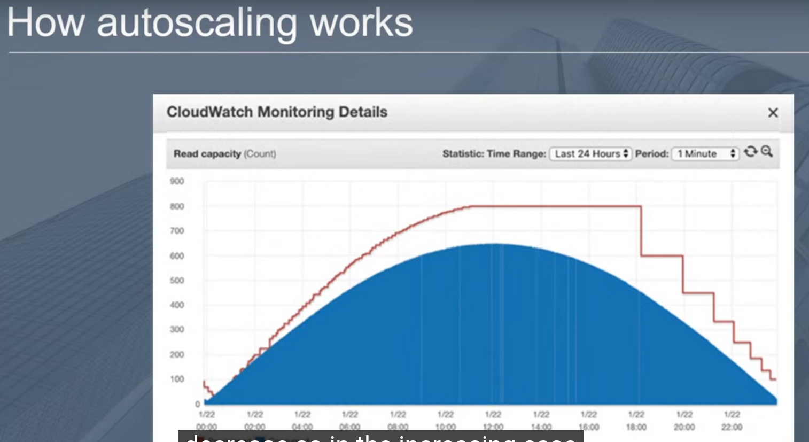

### Partition

A Logicial seperation of  group of objects for hosting your data .

**Example :** Like Binary indexing Done in Sql server

--------- > Partition Key

### Sort Key / Sword Key 

It will again store data in partitions but with sorted order of the sword Key / sort key

**By creating same parttion key we can performed direct lookups like patientId 2 has How many time takes appointment**

### Problem In Primary key 

if Partition two  has bulk of requests, even we have  400 RCU we can only use 200.

     **This was still a  Problem until  2019 May (DynamoDb Released Adaptive Capacity Concept in which u can borrow from other side Free RCU )**
                                     
### when to use what ?

## Use Prefixes , Sufixes and composed Partition key DAX.

### Global Secondary Index

If U use filters , u have to scan each row and it may become cost effective in some time .

### How It Works ActuallY ?

### What is Local Secondary index ?

When u want to check,having partition key someThing with Sort key something and having attribute or starts with aa etc.

**Limitations of LSI**

1- It can Only be defined at Table creation Time .
2- Limited to 5 LSI`s
        
                                **No Extra Cost**

### AutoScaling 

RCU AND WCU 

Consumed Capacity and Provisioned Capacity 

